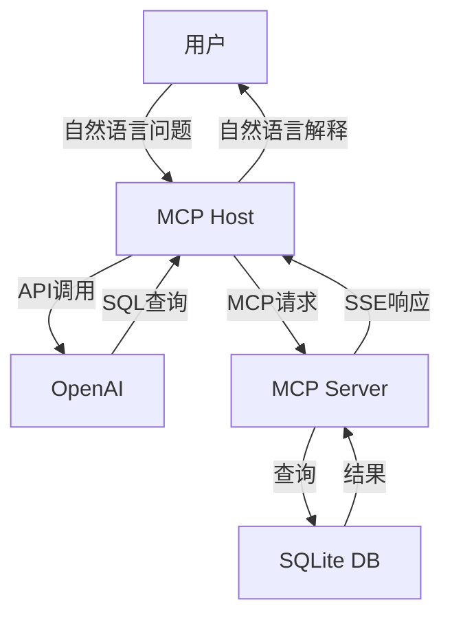

# MCP Host Client Server SSE

基于MCP（Model Context Protocol）协议实现的自然语言SQL数据库查询系统，支持通过大语言模型将自然语言转换为SQL查询。本项目展示了如何使用MCP协议构建服务器-客户端架构，并集成OpenAI实现智能查询功能。

## 功能特点

- 🚀 基于MCP协议的服务器-客户端架构
- 📝 支持自然语言转SQL查询
- 🔄 使用SSE（Server-Sent Events）实现实时通信
- 📊 SQLite数据库集成
- 🤖 OpenAI/DeepSeek接口集成
- 📝 完整的日志记录系统
- ⚡ 异步操作支持

## 系统架构



## 快速开始

### 前置要求

- Python 3.8+
- pip包管理器
- OpenAI API密钥

### 安装步骤

1. 克隆仓库：
```bash
git clone https://github.com/HanShan006/MCP_Host_Client_Server_SSE.git
cd MCP_Host_Client_Server_SSE
```

2. 安装依赖：
```bash
pip install openai mcp-framework starlette uvicorn
```

3. 配置API密钥：
创建config.ini文件并添加以下内容：
```ini
[secrets]
API_KEY=your_api_key_here
```

4. 创建示例数据库：
```bash
python create_database.py
```

### 运行服务

1. 启动MCP服务器：
```bash
python mcp_server.py
```

2. 运行客户端应用：
```bash
python mcp_host.py
```

## 数据库结构

### users表
| 字段 | 类型 | 说明 |
|------|------|------|
| id | INTEGER | 用户ID（主键）|
| name | TEXT | 用户名 |
| age | INTEGER | 年龄 |
| email | TEXT | 邮箱地址 |

### orders表
| 字段 | 类型 | 说明 |
|------|------|------|
| id | INTEGER | 订单ID（主键）|
| user_id | INTEGER | 用户ID（外键）|
| product_name | TEXT | 商品名称 |
| price | REAL | 价格 |
| order_date | TEXT | 订单日期 |

## 示例查询

系统支持多种自然语言查询，例如：

1. "查询所有用户的信息"
2. "显示张三的所有订单"
3. "统计每个用户的消费总额"
4. "查询订单金额超过5000元的用户信息"

## 项目结构

```
MCP_Host_Client_Server_SSE/
├── mcp_server.py      # MCP服务器实现
├── mcp_client.py      # MCP客户端实现
├── mcp_host.py        # 主机程序（集成OpenAI）
├── create_database.py # 数据库初始化脚本
├── database.db        # SQLite数据库文件
├── config.ini         # 配置文件
└── README.md          # 项目文档
```

## 技术栈

- Python 3.8+
- MCP Framework
- SQLite
- OpenAI API
- Starlette
- Server-Sent Events (SSE)
- Async/Await

## 版本历史

### v1.0.0 (2025-05-07)
- ✨ 初始版本发布
- 🎉 实现基础MCP服务器功能
- 🎉 完成客户端通信模块
- 🎉 集成OpenAI自然语言处理
- 🎉 添加SQLite数据库支持
- 📝 完善项目文档

## 贡献者

- 程序员寒山 ([@HanShan006](https://github.com/HanShan006))

## 开源协议

本项目采用 MIT 协议开源，详情请参见 [LICENSE](LICENSE) 文件。
